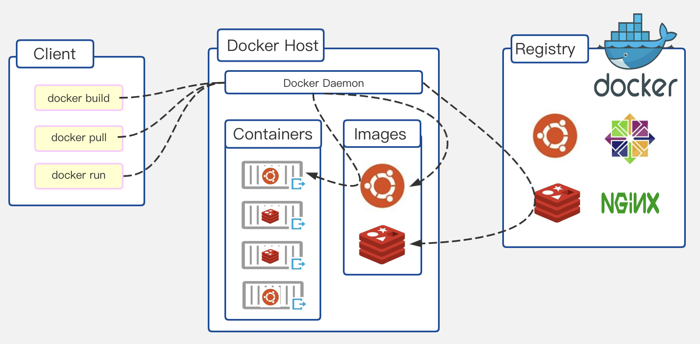
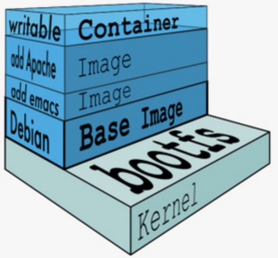
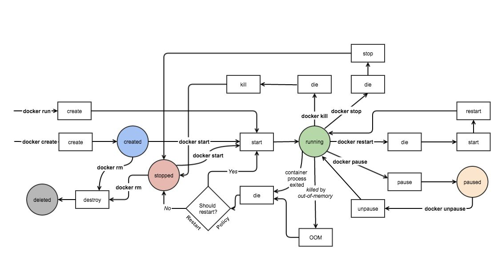

# Docker-从入门到实践

## 1.Docker出现的背景和初衷

### 1.1.IaaS和PaaS

一切从云计算开始讲起。

云计算技术刚被提出的风口浪尖，为了落地云计算，需要做什么呢？

关注亚马逊是如何落地云计算的：AWS（Amazon Web service）。AWS提出了EC2（Elastic Compute Cloud），它做了一件什么事呢？搞基建，建机房，实现虚拟化，对外提供计算服务，AWS把计算机技术渐渐从概念变成了无数的似乎取之不尽用之不竭的虚拟机，我们把这类服务称为IaaS。

而随着IaaS技术的成熟，PaaS技术也在悄然萌芽，以Cloud Foundry为标志的开源PaaS平台已经度过了最艰难的成长初期，站在这个历史的时间点上向后看，似乎PaaS的时代即将到来。

像AWS和Cloud Foundry这样的PaaS平台，最核心的能力就是一套应用的打包和分发机制，利用自己构建的平台将客户的应用发布出去。

### 1.2.Docker的诞生

PaaS时代即将到来，前提是没有一家叫做dotCloud提出Docker这一概念的话，实际上自2013年后到如今，Docker容器技术才是真正引领了时代的服务器技术。

那么Docker和Cloud Foundry的差别到底是什么呢？答案就是：Docker镜像。

Docker不止有处在运行状态的容器概念，还允许各个服务提供商打包自己的镜像，并通过镜像仓库来进行分享和迁移。也正是因为有了镜像功能，就像为容器这支骑兵装上了马鞍，使得Docker技术异军突起，成功成为了开源生态圈的新宠。

此后不久的2014年，Docker公司正式发布了Swarm，这之后的故事，就留到下一门Kubernetes中继续。

## 2.Docker适用场景

传统的IaaS镜像打包包装了整台虚拟机，整个流程笨重复杂。而Cloud Foundry轻装上阵，却遇到了环境适配的难题：应用在本地和在云端的运行效果不一致。那么Docker是怎么做的呢？

同样，用户准备好自己的脚本或者应用程序之后，使用docker build命令，将相关文件打包成一个镜像，然后在服务端下载镜像之后，在使用docker run运行容器。看起来好像和之前的PaaS技术一模一样？但是，docker却拥有本地运行和云端运行环境一致的特点，镜像打包不再有频繁的试错过程。

关键点就在除了脚本和应用程序之外的相关文件上。实际上Docker镜像在打包的过程中，会将整个OS的文件系统都打包进去，因此可以看到一个Docker镜像有几百兆。那么，无论在哪里运行整个镜像容器，都能得到和本地运行一样的效果。但同时呢，它又是容器层面的打包，整个过程不需要反复启停虚拟机去做那些应用运行用不到的软硬件配置。就是这个功能解决了传统PaaS应用打包的痛点，解放了运维人员的生产力。

宽泛地说，Docker仍然属于PaaS技术。Docker使用的场景就是应用的打包和云端虚拟机上的运行，帮助程序员快速分发部署自己的应用。

## 3.Docker的组成部分和关键点

## 3.1.整体架构

Docker整体架构如下图



- Client端：用户操作端
- Host端：Docker所运行的宿主机，Docker daemon守护进程
- Registry端：存储镜像的仓库

## 3.2.Docker三要素

Docker三要素：Registry、Image、Container。

这三者的关系是，Registry存储镜像，而镜像和容器就是应用的一体两面，镜像是存储态的应用，容器就是运行态的应用，容器可以随时从镜像中激活运行启动起来。

关于Docker常用的命令详见第8节。

### 3.2.1.Registry

存储镜像的仓库，Docker有自己的镜像仓库dockerhub，上面有丰富的第三方开源镜像。现在也有很多第三方云计算平台实现了自己的镜像源，来托管各自平台用户的Docker用户，比如亚马逊的Amazon ECR，微软的Azure，阿里云，腾讯云，Google云都有自己的镜像托管平台。

对于开发者而言，可能用到的和Registry相关的两个指令就是docker pull和docker push

### 3.2.2.Image

镜像看起来很简单，但是将一个概念从无到有提出来并不是一个容易的过程。

从刚才的架构图中可以看到，Image既可以存储在Registry中，也可以保存在宿主机本地。想了解Image，最重要的就是了解它的分层思想。



Docker使用Linux的Union File System做了一个巧妙的设计，将镜像分了很多层。

比如图中的这个镜像，最下面是操作系统内核，这部分是不会打包在镜像里面的，在往上可以看到一个Base Image，打包了一个Debian的文件系统，然后再往上两层，是我们构建镜像时额外附加的两层，第一层添加了一个emacs工具，再往上一层添加了一个Apache服务器，这三层就组成了一个完整的镜像（可读不可写）。

这里的每一层都只包含自己新增或修改的文件，而同时宿主机在存储镜像时是按层存储的，两个镜像中的同一层只会存储一次。

最上面一层是Container层，在容器运行时附加的，可以写入文件，在容器停止时这块磁盘空间就会被释放，不建议向这一层写文件，因为容器停止就会丢失。

总结一下关键点：

- 容器层以下所有镜像层都是只读的
- docker从上往下依次查找文件
- 容器层保存镜像变化的部分，并不会读镜像本身进行任何修改
- 一个镜像最多有127层

### 3.2.3.Container

容器技术在之前是PaaS平台上的一个底层技术，到了Docker中就成了大家追捧的明星技术。

容器的生命周期状态图如下：



## 3.3.Dockerfile

制作镜像的要点就是Dockerfile，按照一定的格式要求写好一个Dockerfile之后，就能不断地重复使用进行镜像打包的工作，而打包出的镜像在本地验证成功之前也不需要推到云端。

Dockerfile常用命令：

// TODO

- COPY复制文件

  ```dockerfile
  COPY package.json /usr/src/app
  ```

## 4.Docker的底层原理和关键实现


## 5.纵向比较：Docker的trade-off


## 6.横向比较：容器概念后的生态圈


## 7.Docker命令集


## 8.--